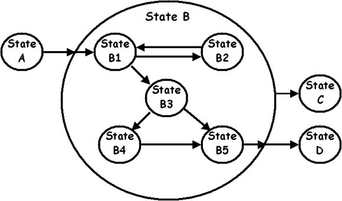

# Laravel Fsm



## Installation

```shell
composer require rapid/fsm
```

## Context
Contexts are the building blocks of FSM. Each context is a collection of states that it manages.

```php
class MyContext extends Context
{
    protected static string $model = MyModel::class;

    protected static array $states = [
        'first' => FirstState::class,
        'second' => SecondState::class,
    ];
}
```


### Context model
Each context needs to be connected to a model and store information about the FSM in itself.

The model must use `InteractsWithContext`:

```php
class MyModel extends Model
{
    use InteractsWithContext;
}
```

And have the following columns:

```php
$table->string('current_state')->nullable();
$table->nullableMorphs('parent');
```

And also implement the following method:

```php
protected function contextClass(): string
{
    return MyContext::class;
}
```

Then, if you have a record, you can use the following helpers:

```php
// Context object
$context = $record->context;

// Current state value
$state = $record->state;

// Current deep state value
$state = $record->deepState;
```

Or you can use the following scopes in your queries:

```php
MyModel::query()
    // Add condition where the state is instance of these classes (or interfaces)
    ->whereState(FooState::class)
    ->whereStateNot(BarState::class)
    ->whereStateIn([FooState::class, MyContract::class])
    ->whereStateNotIn([FooState::class, MyContract::class])
    
    // Add conditions where the state is these classes
    ->whereStateIs(FooState::class)
    ->whereStateIsNot(BarState::class)
    ->whereStateIsIn([FooState::class, BarState::class])
    ->whereStateIsNotIn([FooState::class, BarState::class])
;
```


### Context states
You need to declare the list of states in the $states variable. It is absolutely necessary
to declare all states, but one thing you need to know is that states are not ordered.

The key you define is stored in the current_state column of the model,
instead of the state class name. Defining a key is optional,
but it helps with database readability.

```php
protected static array $states = [
    Foo::class,             // save as "App\States\Foo"
    'bar' => Bar::class,    // save as "bar"
];
```

If you need to dynamically define your states,
just define the states method instead of defining the $states variable.

```php
public static function states(): array
{
    return config('custom.my_fsm.states');
}
```

**Note: Notice that we don't have anything for edges.
In fact, adding edges only adds complexity to the application.
We can handle the input with a controller/service, and the destination by passing
the destination state name.**

### Transitions
If you want the current state to change, you can do so simply with transitionTo.

```php
$state = $context->transitionTo(SecondState::class);
```


## State
Each record can be in a state at any given time.
Each state must specify the characteristics of that state.

```php
class FirstState extends State
{
}
```

States support events:

```php
class FirstState extends State
{
    public function onEnter(): void
    {
    }

    public function onLeave(): void
    {
    }
}
```

You can access the context with the `$parent` property.

```php
class FooStep extends State
{
    public function onEnter(): void
    {
        if (!config('foo.enabled')) {
            $this->parent->transitionToNext();
        }
    }
}
```


## Nested context
You can also create nested FSMs.

In fact, every Context is a State. So, you can use a context instead of your state,
and then introduce that context in the states list of the parent context.

```php
class MyFsmContext extends Context
{
    protected static string $model = MyFsmModel::class;

    protected static array $states = [
        'foo' => FooState::class,
        'bar' => BarContext::class,
        'baz' => BazState::class,
    ];
}

class FooState extends State {}
class BazState extends State {}

class BarContext extends Context
{
    protected static string $model = BarFsmModel::class;

    protected static array $states = [
        'foo' => FooState::class,
    ];
}
```

In the child context, you can customize the record creation (note that the record must exist)

1. If you want it to be created once and loaded later:

```php
public function onLoad(): void
{
    $this->loadRecord() or $this->createRecord([]);
}
```

You can also customize the logic that should be performed when entering this context.
For example, upon entering this context, the context itself should go to a specific state:

```php
public function onEnter(): void
{
    $this->transitionTo(FooState::class);
}
```

In a subcontext, you can also access the parent context:

```php
class SubContext extends Context
{
    public function finish()
    {
        $this->transitionTo(Finished::class);           // End of this subcontext
        $this->parent->transitionTo(BarAccept::class);  // Changing the parent context state
    }
}
```


## Start a fsm

Starting an FSM is as simple as this:

```php
$myRecord = MyFsmRecord::create([
    'my_attribute' => $foo,
]);

$myRecord->context->transitionTo(FirstState::class);
```


## Configuration
Inherit from the `ContextConfiguration` interface or the `DefaultContextConfiguration`
class to customize your context settings.

```php
class MyConfiguration extends DefaultContextConfiguration
{
}
```

Then introduce it into your context:

```php
class MyContext extends Context
{
    protected static string $configurationClass = MyConfiguration::class;
}
```


## Log
Inherit from the `Logger` interface or the `EmptyLogger` class to customize your logging.

```php
class MyLogger extends EmptyLogger
{
}
```

For example, if you want to store a record in a table as a log when a transition occurs:

```php
class MyLogger extends EmptyLogger
{
    public function transition(PendingLog $log): void
    {
        FsmTransitionLog::create([
            'from' => $this->fromState ? $log->context->getStateAliasName($log->fromState::class) : null,
            'to' => $this->toState ? $log->context->getStateAliasName($log->toState::class) : null,
        ]);
    }
}
```

### Use log

By default, if you perform the `transitionTo` operation, no logging occurs:

```php
$context->transitionTo(WaitingForResponse::class); // Without log
```

To use the log, you must first use `useLog` and then `transitionTo`.

```php
$context->useLog()->transitionTo(WaitingForResponse::class); // With log
$context->transitionTo(WaitingForResponse::class, $context->useLog()); // With log
```

You can even pass properties with the `PendingLog` class.

```php
$context->useLog()->with(['status' => 'approved'])->transitionTo(ProfileStep::class);
```

```php
class MyLogger extends EmptyLogger
{
    public function transition(PendingLog $log): void
    {
        FsmTransitionLog::create([
            'from' => $this->fromState ? $log->context->getStateAliasName($log->fromState::class) : null,
            'to' => $this->toState ? $log->context->getStateAliasName($log->toState::class) : null,
            'status' => $log->attributes['status'] ?? 'none',
        ]);
    }
}
```

Or even customize the `PendingLog` class entirely and add new functions:

```php
class RegistrationPendingLog extends PendingLog
{
    public string $withNotification;
    
    public function withNotification(string $message)
    {
        $this->withNotification = $message;
        return $this;
    }
}
```

```php
class RegistrationContext extends Context
{
    public function useLog(): RegistrationPendingLog
    {
        return new RegistrationPendingLog($this);
    }
}
```

```php
class RegistrationLogger extends EmptyLogger
{
    public function transition(PendingLog $log): void
    {
        if ($log instanceof RegistrationPendingLog && isset($log->withNotification)) {
            UserService::getAdmin()->notify(
                new MessageNotification($log->withNotification),
            );
        }
    }
}
```

```php
$context->useLog()
    ->withNotification("A new user registered successfully!")
    ->transitionTo(Completed::class);
```

### Force log

If you need your transitions to always be logged, just change the `$forceLog` variable to true:

```php
class MyContext extends Context
{
    protected static bool $forceLog = true;
}
```

```php
$context->transitionTo(Completed::class); // Now also uses logs
```


## Authorization

Most of the time you need to check if this FSM is in the correct state or not.
In these cases we use the `authorize` method.

```php
$context->authorize(FooState::class);
```

Or we can use the `is` method to just get the true/false value.

```php
if ($context->is(FooState::class)) {
    // code
}
```

But a question arises! How can more complex checks be performed?

> Note: The difference between _check_ and _compare_ is that _check_ focuses on the state and
> sub-states, but _compare_ is responsible for comparing the set and compares
> the current state and the passed state.

### Check type

Choose one of the following types to specify how to check your input state:

**1. CHECK_HAS: Checks whether the current state or its sub-states match this state, at least one of which (default)**

```php
$context->authorize(Something::class, FsmManager::CHECK_HAS);
```

**2. CHECK_HEAD: Checks what the main state is**

```php
$context->authorize(InfoReviewing::class, FsmManager::CHECK_HEAD);
```

**3. CHECK_DEEP: Checks what the deepest state is**

```php
$context->authorize(TechnicalVisiting::class, FsmManager::CHECK_DEEP);
```

**4. CHECK_BUILDING: Deep and one-by-one checking of fsm states**

For example, if you had a state in the main context that was itself a context (nested context), you would pass an array and check it in depth order:

```php
$context->authorize([InfoReviewing::class, TechnicalVisiting::class], FsmManager::CHECK_BUILDING);
//                   ^Check root context^, ^___Check sub-state___^
```


### Compare type

Choose one of the following values to specify how the state you pass should be compared
to the current state.

**1. INSTANCE_OF: Checks if the state of an instance of the class is passed (default)**

```php
$context->authorize(Rejected::class, FsmManager::INSTANCE_OF);
$context->authorize(BaseState::class, FsmManager::INSTANCE_OF);
$context->authorize(SomeContract::class, FsmManager::INSTANCE_OF);

// Also accept array:
$context->authorize([A::class, B::class, C::class], FsmManager::INSTANCE_OF);
```

**2. IS: Checks that the state is exactly the same as the class you passed.**

```php
$context->authorize(Rejected::class, FsmManager::IS);

// Also accept array:
$context->authorize([A::class, B::class, C::class], FsmManager::IS);
```

### Mix check & compare

You can combine check and compare values.

```php
$context->authorize(Rejected::class, FsmManager::CHECK_HEAD | FsmManager::IS);
$context->authorize([InfoReviewing::class, Rejected::class], FsmManager::CHECK_BUILDING | FsmManager::IS);

$context->authorize([InfoReviewing::class, [Rejected::class, Approved::class]], FsmManager::CHECK_BUILDING | FsmManager::IS);
```

### Configure defaults

The default compare value can be set in multiple layers.

1. Context configuration

```php
class MyConfiguration extends DefaultContextConfiguration
{
    public function compare(): ?int
    {
        return FsmManager::IS;
    }
}
```

2. Container

```php
class AppServiceProvider extends ServiceProvider
{
    public function boot()
    {
        Fsm::setDefaultCompare(FsmManager::IS);
    }
}
```

3. Config

fsm.php:

```php
'compare' => FsmManager::IS,
```


## Controllers

To use FSM in your controller, we will give you a suggested method as an example.
You have no restrictions on how you use FSM.

Consider a simple FSM for confirming a user's email; this FSM contains three states:
RequestEmail, RequestCode, and Confirmed.

For this FSM, we need these routes:

```php
Route::controller(EmailConfirmationController::class)->group(function () {
    Route::post('/new-process', 'newProcess');
    Route::post('/{fsm:id}/send-email', 'sendEmail');
    Route::post('/{fsm:id}/check-code', 'checkCode');
});
```

And the controller:

```php
class EmailConfirmationController extends Controller
{
    /**
     * Starts a new process.
     * This route does not require the fsm to already exist.
     * This route checks that this user does not have any pending requests.
     */
    public function newProcess()
    {
        if (EmailConfirmationFsm
            ::where('user_id', auth()->id())
            ->whereStateIsNot(Confirmed::class)
            ->exists()) {
            abort(403);
        }
    
        $fsm = EmailConfirmationFsm::create([
            'user_id' => auth()->id(),
        ]);
        
        $fsm->context->transitionTo(RequestEmail::class);
        
        return view('request-email', compact('fsm'));
    }
    
    /**
     * Gets the email from the user and stores it in the model.
     * This route requires that the user is in the correct state, otherwise an error will occur.
     */
    public function sendEmail(EmailConfirmationFsm $fsm, Request $request)
    {
        $fsm->context->authorize(RequestEmail::class);
        
        $validated = $request->validate([
            'email' => 'required|string|email',
        ]);
        
        $fsm->update([
            'email' => $validated['email'],
            'code' => rand(10000, 99999),
        ]);
        
        $fsm->context->transitionTo(RequestCode::class);
        
        return view('request-code', compact('fsm'));
    }
    
    /**
     * Takes the code from the user, and compares it with the code stored in the database
     */
    public function checkCode(EmailConfirmationFsm $fsm, Request $request)
    {
        $fsm->context->authorize(RequestCode::class);
        
        $validated = $request->validate([
            'code' => 'required|string|digits:5',
        ]);
        
        if ($validated['code'] != $fsm->code) {
            throw ValidationException::withMessages([
                'code' => 'Code is wrong',
            ]);
        }
        
        $fsm->context->transitionTo(Confirmed::class);
        
        return view('confirmed', compact('fsm'));
    }
}
```


## Linear context

A linear context is a simple, linear FSM where each state is executed in sequence.

This class provides you with a few helper methods that help you navigate between your states.

```php
class RegistrationContext extends LinearContext
{
    protected static array $states = [
        'basic profile' => BasicProfileStep::class,
        'phone' => PhoneStep::class,
        'confirm code' => ConfirmCodeStep::class,
        'accept' => AcceptStep::class,
        'finished' => FinishedStep::class,
    ];

    protected static array $path = [
        BasicProfileStep::class,
        PhoneStep::class,
        ConfirmCodeStep::class,
        AcceptStep::class,
    ];
    
    protected static string $endState = FinishedStep::class;
}
```

The path variable specifies the execution order.

Now you use these methods to move to the next and previous state:

```php
$this->transitionToNext();
$this->transitionToPrevious();

$this->useLog()->transitionToNext();
$this->useLog()->transitionToPrevious();
```


## Api

You can define your APIs within the context.

Just add this code to your root path (such as web.php or api.php):

```php
MyContext::routes();
```

|        Attribute        | In contexts | In states | Need to |                   Description                    |
|:-----------------------:|:-----------:|:---------:|:-------:|:------------------------------------------------:|
|           Api           |     yes     |    yes    |         |             Introducing a new route              |
|      WithoutRecord      |     yes     |    no     |   Api   |  Eliminates the need for records from the route  |
| WithMiddleware (class)  |     yes     |    no     |         |          Adds middleware to all routes           |
| WithMiddleware (method) |     yes     |    yes    |   Api   |           Adds middleware to the root            |
|       OverrideApi       |     no      |    yes    |         |             Overrides a defined API              |
|         OnState         |     yes     |    yes    |   Api   |          Checks that the state matches           |
|     IntoTransaction     |     yes     |    yes    |   Api   | Executes the function in a database transaction. |

```php
#[WithMiddleware(['auth'])]
class MyContext extends Context
{
    #[Api, WithoutRecord]
    public function initialize()
    {
        $this->createRecord([
            'user_id' => auth()->id(),
        ]);
        
        return response()->json([
            'ok' => true,
            'data' => [
                'id' => $this->record->id,
            ],
        ]);
    }
}
```

Use the `Api` attribute to specify which functions should be defined in routes.

Function inputs are exactly the same as controllers.

```php
#[Api, WithoutRecord]
public function initialize()
{
}

#[Api]
public function foo(Request $request, MyService $service)
{
}

#[Api('users/{user:id}')]
public function showUser(User $user)
{
}

#[Api('users/{user:id}', method: 'POST', name: 'update_the_user', middleware: ['signed'])]
public function updateUser(User $user)
{
}
```
